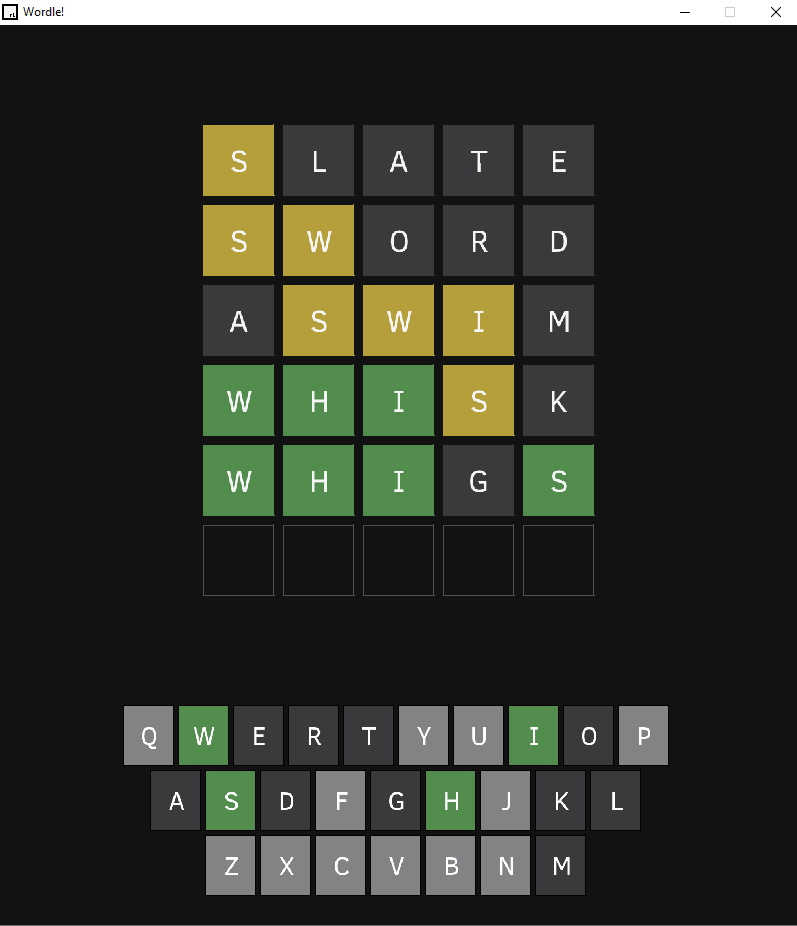
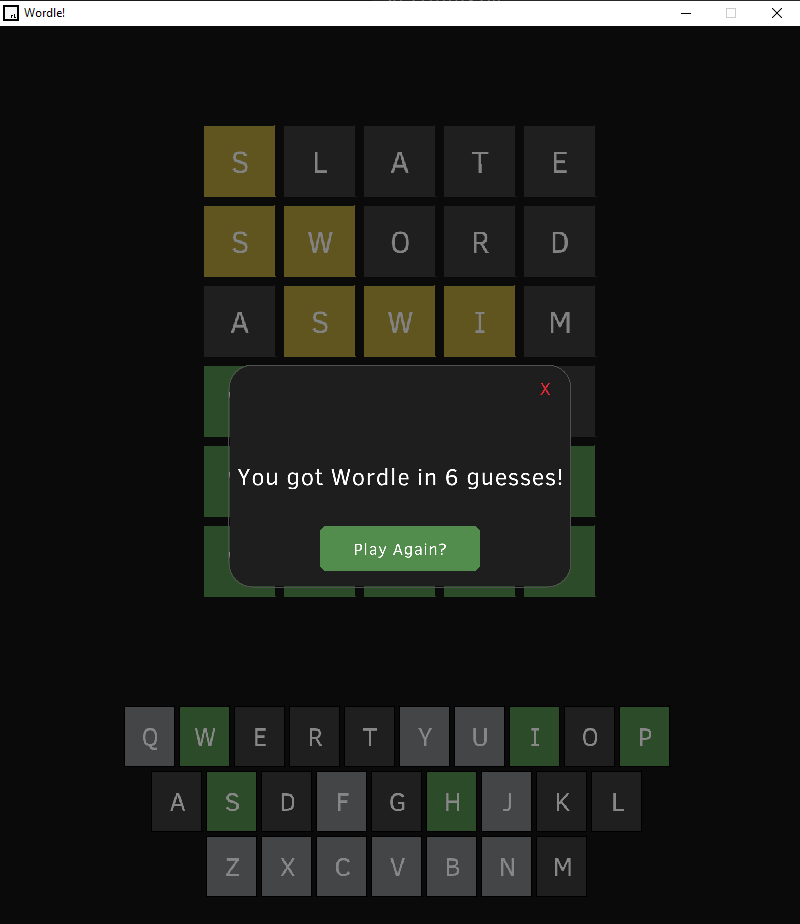

# Raylib Wordle Recreation

A recreation of the NYT Wordle game built in C++ using the raylib graphics library.

This project was created to practice game loop architecture, rendering systems,
input handling, and game state management while recreating the mechanics of Wordle.

## Download
[Download Latest Release](https://github.com/mosunna/Raylib-Wordle-Recreation/releases/download/1.0/Wordle-Release.zip)
- Use the download link above.
- Extract zip to desired location. 
- ALL ZIP FILE CONTENTS MUST BE IN SAME DIRECTORY FOR GAME TO WORK

## Gameplay

## Features

- Correct duplicate-letter handling using tracked letter state logic
- Color-coded tile feedback system
- Dynamic on-screen keyboard
- Mouse and keyboard input support
- Random word generation from a word list
- Invalid word detection with auto-dismiss popup
- Win/loss game states
- Play Again system with full game reset

## Technical Details

- Built in C++
- Uses raylib for rendering and input handling
- Uses vector-based game states
- Dynamic keyboard UI system
- Dynamic board rendering system
- Object-oriented keyboard key implementation

## What I Learned
- Rendering UI elements dynamically with raylib
- Handling keyboard and mouse inputs
- Structuring real-time game loop architecture
- Restructring a project into dedicated functions

